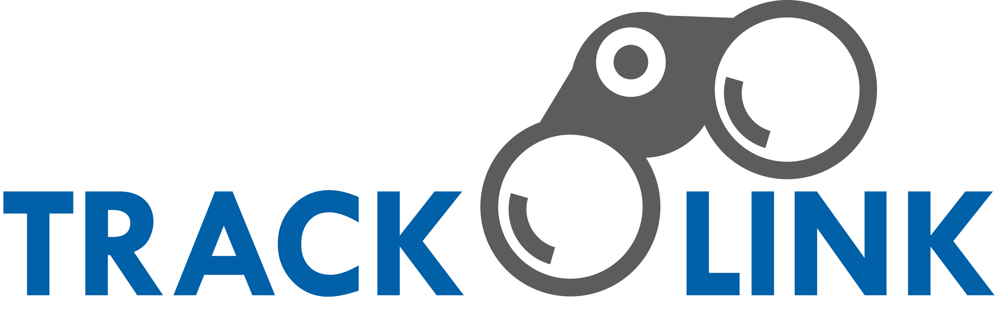

# Project Proposal
Group 10
CMPT 276-D1
Summer 2016
---
## Abstract
Tracklink empowers users by giving them detailed information about their commute, allowing them to hold Translink accountable. It keeps track of when transit vehicles are expected to arrive both according to schedule and GPS data. In addition, it provides neatly-presented historical data allowing it to inform the user about how late or early a bus tends to be and how likely it is to be cancelled. If a bus is late, doesn't arrive, or if the user has a negative experience, they can easily let Translink know. At the end of a trip, the user can specify the bus they were on and tweet @Translink with feedback. Commuters can sign up to save their favorite transit lines and stops. Tracklink leverages the Translink Open API to provide users with the most accurate information available, its historical graphing functionality is powered by the d3 API, and its Twitter integration is powered by the Twitter API.
Existing Systems
Currently, there are a selection of web-apps and mobile apps that have some of the functionality of Tracklink. Google Maps, Translink Next Bus, and Transit App are examples, and they all do a fair job of providing a basic schedule browser and real-time estimates. However, only Google Maps provides transparent information about how late or early a bus is. Transit App is the only one that provides functionality to favorite a route, but it does not allow you to favorite a stop number, nor does it sync across devices via user login. Transit App is also the only one that allows you to drop a pin to find the schedule of nearby bus stops, but it is poorly implemented and takes quite a while to populate the list. None of the apps provide historical data, a likelihood of cancellation, or the ability to communicate with Translink directly without leaving the app.
Our Improvements
Tracklink provides all of these functions in one easy-to-use, responsive, cross platform webapp. It clearly displays both the scheduled and calculated times of arrival so users aren’t surprised. By leveraging user accounts, it is able to save preferences, lines and stops for the user, regardless of the device they’re on. Tracklink is also the only one that can show a user how late a bus typically is and how often it is cancelled.  It does this by keeping databases of the past few weeks of transit data. It also allows you to drop a pin in order to find schedules for the stations/stops nearby. Tracklink is the only app that encourages Translink to be more accountable for their vehicles. If a user’s bus is very late, very early, or if they had a bad interaction with the vehicle operator, Translink will hear about it. Tweets to Translink can be automatically composed and easily sent directly from the app, and users are able to provide details about the issue, location, and time.
## User Stories
A user that is not logged in can easily enter or select the stop number, transit line, or location that they are interested in seeing timings for. Of course, they can also sign up simply by specifying a username and password. 
A logged in user can additionally link their Twitter account to provide feedback to Translink. As well, they can set a favorites of vehicles or stops to keep track of, save their preferences, and view/export historical data/graphs. 
A user with admin access can additionally view analytics related to users.

